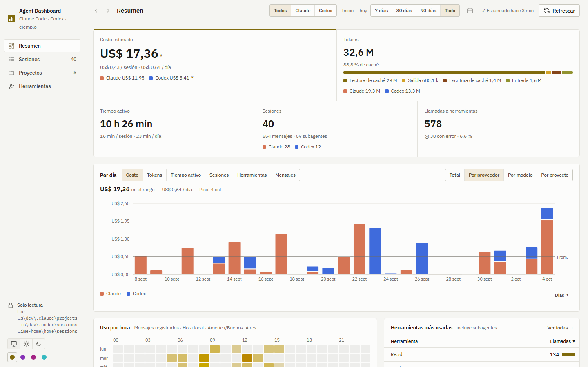
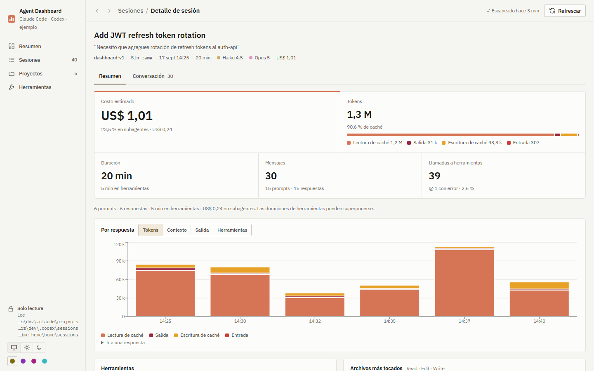
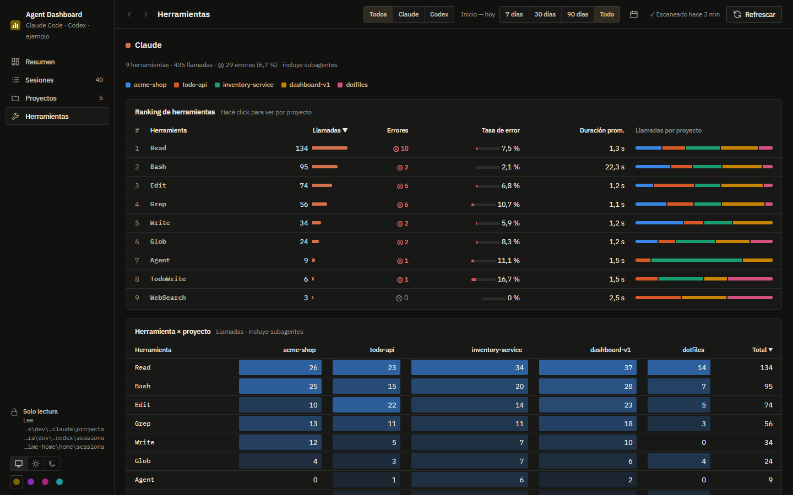

<p align="center">
  
</p>

<h1 align="center">Agent Dashboard</h1>

<p align="center">
  A read-only desktop dashboard for your <b>Claude Code</b> and <b>Codex</b> sessions.
</p>

Agent Dashboard reads the session logs that Claude Code and Codex already keep on your machine and
turns them into costs, token usage, models, projects, tool calls, activity patterns and per-session
timelines. Everything stays local: no account, no server, no telemetry, no database.



## Why read-only

Those logs are your agents' memory: they are what lets a session be resumed. A dashboard has no reason
to change them, so this one can't. The app only opens files for reading, ships no filesystem, shell or
dialog plugins (Tauri capabilities stay at `core:default`), and has no edit, delete or "open in editor"
actions. A guard script (`npm run check:readonly`) is part of `npm run check`. The only action is
**Refrescar**, which rescans the logs into memory.

## Features

- **Overview** — estimated cost, tokens (cache read/write, input, output), active time, sessions and
  tool calls, with daily trends by provider, model or project.
- **Claude Code and Codex** side by side, or filtered to one provider.
- **Activity** — an hour-by-weekday heatmap in your local timezone.
- **Sessions** — searchable, filterable list (project, model, date range) with sorting.
- **Session detail** — per-response token and cost charts, tools used, touched files, and the full
  conversation with tool inputs/results and subagents attached to their parent call.
- **Projects** — the same dashboard scoped to one project.
- **Tools** — call ranking, error rates, durations and a tool × project matrix.
- Light, dark and system themes, plus a few accent colors.

The UI is currently in Spanish.

| Session detail | Tools (dark) |
| --- | --- |
|  |  |

## Install

Download the Windows installer (`.msi` or `.exe`) from the
[Releases](https://github.com/LuchoC-Dev/agent-dashboard/releases) page and run it.

The builds are **not code-signed**, so Windows SmartScreen may show "Windows protected your PC".
Choose **More info → Run anyway** if you trust the release, or build it yourself from source.

## Where it reads data

| Provider | Location |
| --- | --- |
| Claude Code | `~/.claude/projects/**/*.jsonl` |
| Codex | `sessions/` and `archived_sessions/` under each Codex home: `$CODEX_HOME`, `~/.codex`, and Orca's Codex runtime home on Windows (`%APPDATA%\orca\codex-runtime-home\home`) |

Files are read live and cached in memory. Costs are estimates computed from public model pricing.

## Build from source

Requirements:

- [Rust](https://rustup.rs/) (stable; MSVC toolchain on Windows) and the
  [Tauri v2 prerequisites](https://v2.tauri.app/start/prerequisites/) for your OS
  (on Windows: Visual Studio Build Tools with C++ and WebView2, preinstalled on Windows 11)
- Node.js 24+

```sh
npm install
npm run tauri dev     # run the desktop app
npm run tauri build   # build the installer
npm run dev:mock      # UI only, in the browser, with anonymized sample data
npm run check         # read-only guard, typecheck, tests, Rust tests
```

## How it's built

Tauri v2 (Rust) backend, React 19 + TypeScript frontend with React Router, TanStack Query, Tailwind CSS
and Recharts. Provider-agnostic types live in `src-tauri/src/model.rs` and are exported to TypeScript
with ts-rs; each provider is a `SessionSource` implementation.

The project was developed with AI coding agents working on parallel tracks against a shared contract.
[AGENTS.md](AGENTS.md) holds the conventions they follow, and [docs/](docs/) the architecture notes
([frontend](docs/architecture/frontend.md)), design work and briefs.

## License

[MIT](LICENSE)
